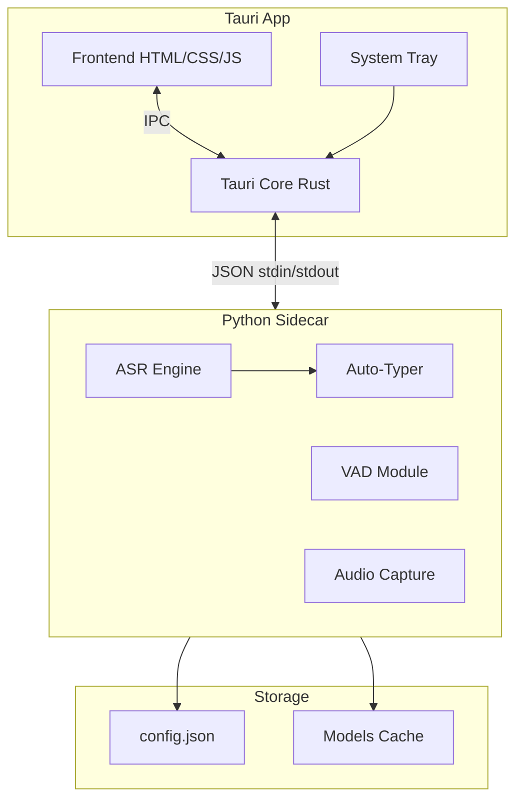

# SuperWhisper Clone - Architecture Tauri + Python

## Architecture Globale



## Structure du Projet

```
super-whisper/
├── src-tauri/              # Backend Tauri (Rust)
│   ├── src/
│   │   └── main.rs         # Point d'entree, gestion sidecar
│   ├── Cargo.toml
│   └── tauri.conf.json     # Config Tauri + sidecar
├── src/                    # Frontend (HTML/CSS/JS)
│   ├── index.html          # Overlay recording
│   ├── settings.html       # Fenetre settings
│   ├── styles.css
│   └── app.js              # Logique frontend
├── python/                 # Backend Python (sidecar)
│   ├── main.py             # Point d'entree CLI JSON
│   ├── transcriber.py      # Logique ASR (code actuel refactore)
│   ├── audio.py            # Capture audio + waveform data
│   ├── typer.py            # Simulation frappe / clipboard
│   ├── config.py           # Gestion config JSON
│   └── requirements.txt
├── config.json             # Preferences utilisateur
└── package.json
```

## Communication Tauri - Python

Protocol JSON via stdin/stdout :

```json
// Tauri -> Python (commandes)
{"cmd": "start_recording", "device_id": 2}
{"cmd": "stop_recording"}
{"cmd": "get_devices"}
{"cmd": "set_config", "key": "model", "value": "whisper-base"}

// Python -> Tauri (evenements)
{"event": "recording_started"}
{"event": "audio_level", "level": 0.45, "waveform": [0.1, 0.3, ...]}
{"event": "recording_stopped", "duration": 5.2}
{"event": "transcription_done", "text": "Hello world"}
{"event": "error", "message": "..."}
```

## Composants Cles

### 1. Overlay Recording (Floating Window)

Fenetre toujours au premier plan avec :
- Indicateur rouge "Recording"
- Timer (0:00, 0:01, ...)
- Waveform en temps reel (canvas)
- Transparence/blur background

### 2. Settings Window

- **Microphone** : Liste deroulante des devices
- **Modele ASR** : Parakeet TDT v3, Whisper base, Whisper large-v3-turbo, Vosk
- **VAD** : Toggle on/off
- **Hotkey** : Capture du raccourci personnalise
- **Output** : Simulate typing vs Clipboard paste
- **Language** : Auto-detect (affichage info seulement)

### 3. System Tray

- Icone dans la barre systeme
- Menu : Settings, Quit
- Indicateur visuel quand recording (icone change)

### 4. Python Backend ([main.py](main.py) refactore)

Le code actuel sera reorganise en modules :
- `transcriber.py` : Classes pour chaque modele ASR
- `audio.py` : Capture audio avec streaming waveform
- `typer.py` : pyautogui pour simulation, pyperclip pour clipboard
- `config.py` : Load/save config.json

### 5. Global Hotkey

Gere cote Tauri avec le plugin `tauri-plugin-global-shortcut` :
- Enregistrement du hotkey configurable
- Detection press/release pour push-to-talk

## Dependances

**Tauri (package.json) :**
- `@tauri-apps/api`
- `@tauri-apps/plugin-global-shortcut`
- `@tauri-apps/plugin-shell` (pour sidecar)

**Python (requirements.txt) :**
- onnx-asr
- sounddevice
- numpy
- scipy
- pyautogui (cross-platform typing)
- pyperclip (clipboard)

## Packaging Cross-Platform

Tauri bundlera Python comme sidecar :
- **macOS** : .app bundle avec Python embedded via PyInstaller
- **Windows** : .exe avec Python embedded
- **Linux** : AppImage avec Python embedded

## Phases de Developpement

### Phase 1 : Refactoring Python
Reorganiser [main.py](main.py) en modules avec interface JSON CLI.

### Phase 2 : Setup Tauri
Creer le projet Tauri, configurer le sidecar Python.

### Phase 3 : Overlay UI
Implementer la fenetre flottante avec waveform.

### Phase 4 : Settings UI
Fenetre de configuration complete.

### Phase 5 : Global Hotkey
Integration du raccourci configurable.

### Phase 6 : Auto-Typing
Implementation simulation frappe + clipboard.

### Phase 7 : Packaging
Build pour les 3 plateformes.